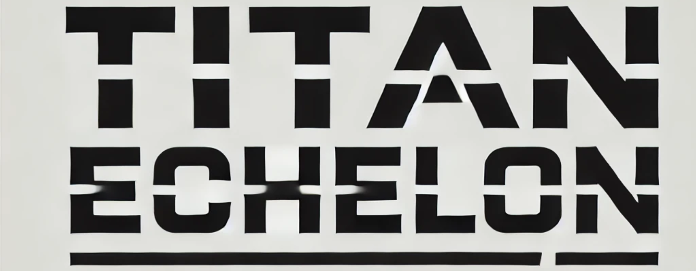

<p align="center">
<picture>
    
</picture>
<br>
<a href="https://crates.io/crates/titanai/0.1.2"></a> &nbsp;
<a href="https://discord.gg/vYJjtjCbkW"></a>
&nbsp;
<a href="https://github.com/TitanEchelonAI/titan"></a>
<br>
<a href="https://docs.rs/crate/titanai/latest"></a>
&nbsp;
<a href=""></a>
&nbsp;
<a href="https://x.com/TitanEchelonAi"></a> &nbsp;

<br>
</p>
&nbsp;

✨ If you would like to help spread the word about Titan, please consider starring the repo!

> [!WARNING]
> We plan to ship a torrent of features in the following months, future updates **will** contain **breaking changes**. With Titan evolving, we'll annotate changes and highlight migration paths as we encounter them.

## [What is Titan?](https://www.titanechelonai.com/developer-wiki)
Titan is a Rust library for building scalable, modular, and ergonomic **LLM-powered** applications.

More information about this crate can be found in the [official documentation](https://www.titanechelonai.com/whitepaper) and the [API Reference documentation](https://docs.rs/crate/titanai/latest).

Join our [Discord community](https://discord.gg/vYJjtjCbkW) to contribute, provide feedback, and connect with other developers.

## [Get Started](https://www.titanechelonai.com/beginner-guide)
```bash
cargo add titan-core
